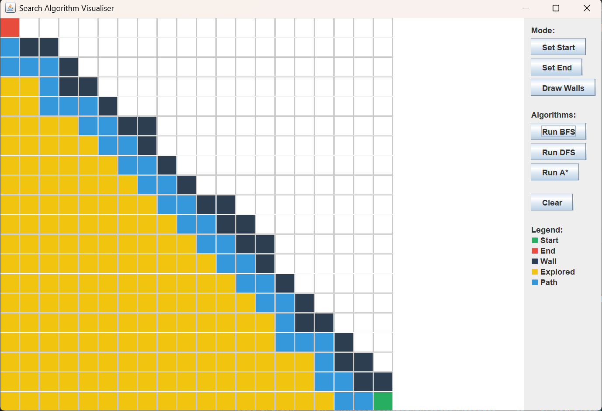
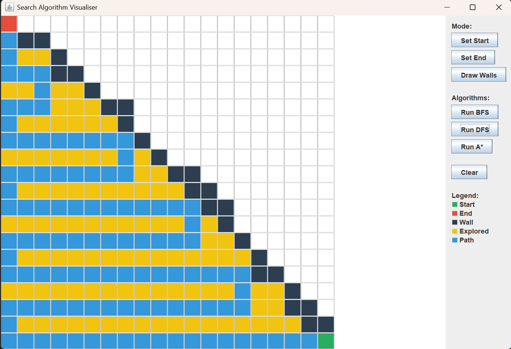
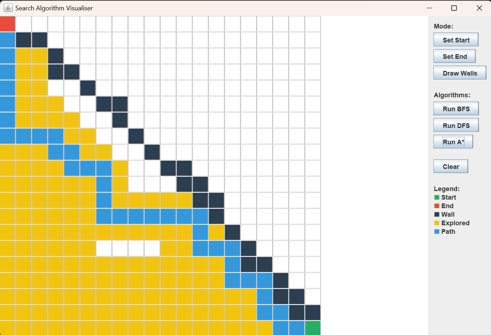

# Search Algorithm Visualiser

An interactive Java / Swing desktop application that visualises how classic pathfinding
algorithms — **Breadth-First Search (BFS)**, **Depth-First Search (DFS)**, and **A\*** —
explore a grid and find a route between two points.

Draw your own walls, place a start and an end cell, and watch each algorithm search the
grid in real time. The app colour-codes explored cells against the final path, making the
difference in behaviour between the three algorithms immediately visible.

> Built to deepen my understanding of graph traversal and pathfinding, and to practise
> event-driven GUI design in Java.

---

## Demo

| BFS | DFS | A\* |
|:---:|:---:|:---:|
|  |  |  |

**Legend** — 🟩 Start  ·  🟥 End  ·  ⬛ Wall  ·  🟨 Explored  ·  🟦 Final path

---

## Features

- **Interactive grid** — place the start and end cells, then draw and erase walls with the mouse.
- **Three search algorithms** — BFS, DFS, and A\*, each runnable on the same map for direct comparison.
- **Live visualisation** — explored cells (yellow) are shown separately from the reconstructed path (blue).
- **Clear / reset** — wipe the grid and start again at any time.
- **Colour-coded legend** — every cell state is labelled in the side panel.

---

## The algorithms

| Algorithm | Strategy | Shortest path? | Notes |
|-----------|----------|:--------------:|-------|
| **BFS** | Explores the grid in layers, expanding all cells at distance *k* before distance *k+1* | ✅ Yes | Optimal on an unweighted grid. Explores broadly. |
| **DFS** | Follows one branch as deep as possible before backtracking | ❌ No | Finds *a* path, not necessarily the shortest — the longer, winding path is expected behaviour. |
| **A\*** | Informed search using `f(n) = g(n) + h(n)`, where `g` is cost-so-far and `h` is the heuristic (Manhattan distance to the goal) | ✅ Yes | Optimal *and* efficient — with an admissible heuristic it typically explores far fewer cells than BFS while still returning the shortest path. |

The visual takeaway: BFS and A\* return paths of the **same length**, DFS returns a longer one,
and A\* gets there while exploring the **fewest cells** — the practical payoff of using a heuristic.

---

## How it works

The project separates three concerns:

- **Model** — the grid and individual cells (state: empty, wall, start, end, explored, path).
- **Algorithms** — BFS, DFS, and A\* implemented over the grid, returning the explored set and the reconstructed path.
- **UI** — a Swing front end that renders the grid, handles mouse input for drawing walls / setting endpoints, and triggers each algorithm from the control panel.

> *Adjust the class names above to match your actual source files (e.g. `Grid`, `Cell`,
> `Pathfinder`, `VisualiserFrame`) so the section mirrors your code.*

---

## Getting started

### Prerequisites
- JDK 17 or later (`java -version` to check)

### Run it

```bash
# clone
git clone https://github.com/goutami-15/search-algorithm-visualiser.git
cd search-algorithm-visualiser

# compile
javac src/*.java -d out

# run (replace Main with your entry-point class)
java -cp out Main
```

*If your sources aren't in a `src/` folder, point `javac` at the right path. If you use an
IDE (IntelliJ / Eclipse), just open the project and run the main class.*

---

## What I learned

- Implementing and comparing uninformed (BFS, DFS) vs informed (A\*) search on the same problem.
- Why BFS guarantees the shortest path on an unweighted graph but DFS does not.
- How a heuristic makes A\* both optimal and efficient, and what "admissible" means in practice.
- Building a responsive Swing UI with custom rendering and mouse-driven interaction.

## Possible extensions

- Weighted cells + **Dijkstra's algorithm**
- Diagonal movement
- A step-by-step / adjustable-speed animation mode
- Procedural maze generation
- A counter showing cells-explored and path-length per run (great for comparing algorithms quantitatively)

---

## Tech

Java · Swing · Graph algorithms (BFS, DFS, A\*)